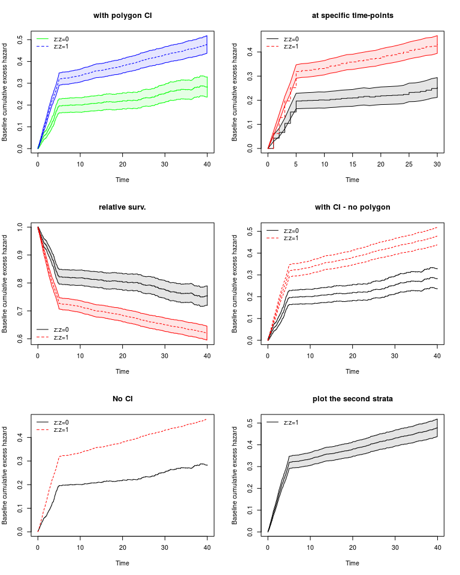

<!-- README.md is generated from README.Rmd. Please edit that file -->
matchsurv
=========

The goal of matchsurv is to estimate the cumulative excess risk for exposed individuals when matched survival data are available.

Installation
------------

You can install matchsurv from github with:

``` r
# install.packages("devtools")
devtools::install_github("cribosch/matchsurv")
```

Example
-------

### matched survival data

``` r
library(matchsurv)
#> Loading required package: survival
#> Loading required package: timereg
#> Loading required package: mets
#> Loading required package: lava
#> lava version 1.5.1
#> mets version 1.2.2
```

For each exposed individual we have a defined number of unexposed individuals, matched according to some relevant factors (the number of unexposed individuals per exposed can be different).

Here it is an example of the data:

``` r
d<-data.sim(5000,5)
head(d,10)
#>        time status expo id j x z       cc
#> 1  63.97744      0    0  1 2 0 1 66.08425
#> 2  61.59965      0    0  2 2 0 1 70.83388
#> 3  73.17210      0    0  3 2 1 1 62.98222
#> 4  42.21481      1    0  4 2 0 1 60.85090
#> 5  74.00916      0    0  5 2 1 1 68.62952
#> 6  62.52744      0    0  6 2 0 1 66.99557
#> 7  79.54926      0    0  7 2 1 1 59.73981
#> 8  20.70074      1    0  8 2 1 1 63.95996
#> 9  74.89154      0    0  9 2 1 1 63.72914
#> 10 78.27219      0    0 10 2 1 1 67.20607
```

`matchsurv::data.sim` let you simulate some matched survival data; `competing=TRUE` will let you chose for a competing risk setting; when `nullmod=TRUE` no covariates are simulated.

This is a basic example which shows you how to:

1.  estimate the proportional excess model
2.  visualize your results - coefficient estimates and cumulative excess hazard plot

### model estimate

First you need to set up your data in order to estimate the model

``` r
names(d)
#> [1] "time"   "status" "expo"   "id"     "j"      "x"      "z"      "cc"
setd<-compdata(Surv(time, status)~x+z+cc, data=d, idControl = j, cluster=id)
names(setd)
#> [1] "exit"       "status"     "cluster"    "unexp.subj" "weight"    
#> [6] "x"          "z"          "cc"
```

`strata()` are not needed in here; you'll choose after how to specify your model. It is a good idea to use all the possible covariates at this step. New variables will be created, you'll need them in the following step.

Then you can estimate your model:

``` r
m <- matchpropexc(Surv(exit,status)~strata(z)+factor(x),cluster=cluster, idControl=unexp.subj, weight=weight,data=setd)
```

model results
-------------

To visualize the coefficient estimates

``` r

summary(m)
#> 
#>      n events
#>   4875    619
#>  20125   2810
#> 
#>            Estimate     S.E. P-value
#> factor(x)1 0.031365 0.053170  0.5553
```

To estimate the cumulative baseline excess hazard:

``` r

cumhaz <- exccumhaz(m) #it's a list because of strata
cumhaz <- exccumhaz(m, time=seq(0,30,5)) #you can chose at which time-points to show the estimates
```

To plot the cumulative baseline excess hazard:

*Note: if your model has strata, you can chose which strata to plot (option: `stratas=`, followed by the number of the strata, the first one is number 0). You can also decide to show the relative survival (option: `relsurv=TRUE`).*

``` r
par(mfrow=c(3,2))
excplot(m, se=TRUE, col=c("green","blue"), main="with polygon CI") 
excplot(m, se=TRUE, time=seq(0,30,1), main="at specific time-points") 
excplot(m, se=TRUE, relsurv=TRUE, main="relative surv.") 
excplot(m, se=TRUE, polygon=FALSE, main="with CI - no polygon") 
excplot(m, se=FALSE, main="No CI") 
excplot(m, se=TRUE, stratas=1, main="plot the second strata") 
```


